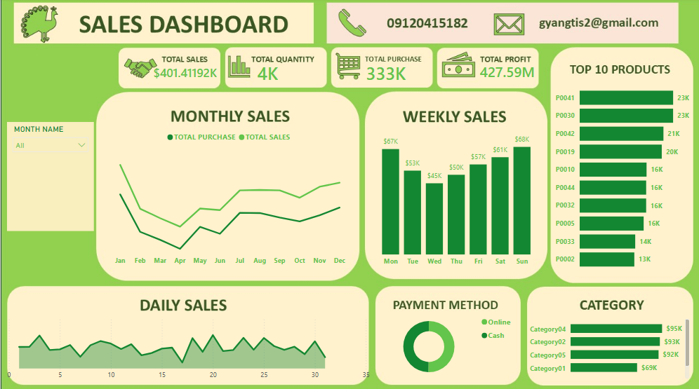

# 📊 Sales Dashboard

## 📌 Project Overview

This project presents an interactive **Sales Dashboard** designed to provide a clear overview of sales performance, purchasing activity, profitability, product performance, payment methods, and category-level results.

The dashboard brings multiple business indicators together in a single view, allowing users to quickly identify sales patterns, high-performing products, weekly and daily trends, and category performance.

---

## 🖼️ Dashboard Image

The dashboard image is included below:



### 📂 How to Upload the Dashboard Image to GitHub

1. Create a folder called **`assets`** in your GitHub repository.
2. Upload your dashboard image into the `assets` folder.
3. Rename the image to:

```text
sales-dashboard.png
4. Your repository structure should look like this:
Sales-Dashboard/
│
├── README.md
│
└── assets/
    └── sales-dashboard.png
5. The following Markdown code displays the image in your README:

Tip: If your image has a different filename, replace sales-dashboard.png with the exact filename of your uploaded image.

📈 Key Performance Indicators (KPIs)
KPI	Value
Total Sales	$401.41K
Total Quantity	4K
Total Purchase	333K
Total Profit	427.59M


📅 Monthly Sales
The Monthly Sales line chart compares Total Purchase and Total Sales from January through December.
This visualization helps to:
- Track sales performance throughout the year.
- Compare sales against purchases.
- Identify increases and decreases in monthly performance.
- Identify possible seasonal patterns.
- Understand periods of stronger or weaker business activity.
The dashboard shows fluctuations throughout the year, with sales and purchase values changing across the different months.
📆 Weekly Sales
The Weekly Sales chart displays sales performance from Monday to Sunday.
Day	Sales
Monday	$67K
Tuesday	$53K
Wednesday	$45K
Thursday	$50K
Friday	$57K
Saturday	$61K
Sunday	$68K


🏆 Top 10 Products
The Top 10 Products visual identifies products with the highest displayed sales values.
Rank	Product	Sales
1	P0041	23K
2	P0030	23K
3	P0042	21K
4	P0019	20K
5	P0010	16K
6	P0044	16K
7	P0032	16K
8	P0005	16K
9	P0033	14K
10	P0002	13K


📊 Daily Sales
The Daily Sales area chart displays sales fluctuations across the days of the month.
It can be used to identify:
- High-sales days
- Low-sales days
- Short-term sales fluctuations
- Changes in daily performance
- Periods that may require further investigation
💳 Payment Method
The Payment Method donut chart compares transactions made through:
- Online
- Cash
This provides a quick overview of customer payment preferences.
🗂️ Category Performance
The dashboard compares sales performance across four categories:
Category	Sales
Category04	$95K
Category02	$93K
Category05	$92K
Category01	$69K


🔎 Dashboard Filter
The dashboard includes a Month Name filter that allows users to select a specific month and analyze the dashboard based on the selected period.
💡 Key Insights
Based on the dashboard:
- Total Sales: approximately $401.41K
- Total Quantity: approximately 4K
- Total Purchase: approximately 333K
- Total Profit: approximately 427.59M
- Sunday records the highest displayed weekly sales at approximately $68K.
- Wednesday records the lowest displayed weekly sales at approximately $45K.
- P0041 and P0030 both record approximately 23K.
- Category04 has the highest displayed category value at approximately $95K.
- Category01 has the lowest displayed category value at approximately $69K among the categories shown.
🛠️ Skills Demonstrated
This project demonstrates:
- Data cleaning and preparation
- KPI development
- Data visualization
- Sales analysis
- Trend analysis
- Product performance analysis
- Category analysis
- Dashboard design
- Interactive filtering
- Business insight generation
- Data storytelling
🚀 Future Improvements
Possible improvements include:
- Year-over-year sales comparison
- Sales growth percentage
- Profit margin percentage
- Average order value
- Sales by location or region
- Customer segmentation
- Actual vs. target sales
- Monthly profit analysis
- Product drill-through pages
- Category drill-through pages
- Dynamic KPI cards
- Interactive tooltips
🎯 Conclusion
The Sales Dashboard provides a consolidated view of important sales and purchasing indicators.
By combining KPIs with monthly, weekly, daily, product, payment-method, and category visualizations, the dashboard provides multiple perspectives for understanding sales performance.
This project demonstrates how raw sales data can be transformed into an interactive Business Intelligence dashboard that communicates important information clearly and supports data-driven analysis.
👨‍💻 Author
Tis Gyang
Sales Analytics Dashboard — Data Analytics Portfolio Project

### 📁 GitHub folder structure

Make sure your repository looks like this:

```text
Sales-Dashboard/
│
├── README.md
│
└── assets/
    └── sales-dashboard.png
